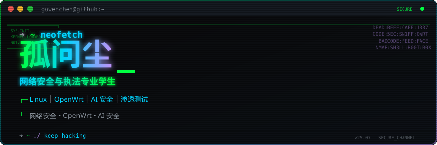

<div align="center">

<!-- ============================================ -->
<!-- HEADER SVG — replace YOUR_GITHUB_USERNAME    -->
<!-- ============================================ -->


</div>

<!-- ============================================ -->
<!-- TYPING SVG                                   -->
<!-- ============================================ -->
<div align="center">

[](https://git.io/typing-svg)

</div>

<!-- ============================================ -->
<!-- VISITOR BADGE                                -->
<!-- ============================================ -->
<div align="center">

[](https://github.com/YOUR_GITHUB_USERNAME)

</div>

<br />

<!-- ============================================ -->
<!-- ABOUT ME                                     -->
<!-- ============================================ -->
<div align="left">

## 👨‍💻 About Me

```yaml
winter@github:~$ cat /etc/profile

username      : Winter
role          : Cyber Security Student
institution   : Network Security & Law Enforcement
location      : China

interests:
  - 🎓 Network Security & Law Enforcement
  - 🐧 Linux Systems (Arch, Debian, Ubuntu Server)
  - 🔐 Penetration Testing & Web Security
  - 🌐 OpenWrt Router Firmware & Network Devices
  - 🤖 AI Security — Transformer-based Anomaly Detection
  - 🐳 Docker & Containerized Security Labs
  - 🛡️ SQL Injection Detection & Traffic Analysis
  - 🔬 ARM Linux & Embedded Systems

current_focus:
  - Transformer models for SQL injection detection
  - Custom OpenWrt security gateway firmware
  - Containerized security research environments
```

</div>

<br />

---

<br />

<!-- ============================================ -->
<!-- TECH STACK                                   -->
<!-- ============================================ -->
<div align="center">

## 🛠 Tech Stack

### Operating Systems

[](https://skillicons.dev)
[](https://skillicons.dev)
[](https://skillicons.dev)
[](https://skillicons.dev)

### Languages & Scripting

[](https://skillicons.dev)
[](https://skillicons.dev)
[](https://skillicons.dev)
[](https://skillicons.dev)
[](https://skillicons.dev)

### DevOps & Infrastructure

[](https://skillicons.dev)
[](https://skillicons.dev)
[](https://skillicons.dev)
[](https://skillicons.dev)
[](https://skillicons.dev)
[](https://skillicons.dev)

### Security Tools


### AI & ML


### Editors & Terminals


</div>

<br />

---

<br />

<!-- ============================================ -->
<!-- SECURITY FOCUS                               -->
<!-- ============================================ -->
<div align="center">

## 🛡 Security Focus

<table>
<tr>
  <td align="center" width="33%">
    <br />
    <sub>XSS • CSRF • SQLi • SSRF</sub>
  </td>
  <td align="center" width="33%">
    <br />
    <sub>ML-based Detection • Log Analysis</sub>
  </td>
  <td align="center" width="33%">
    <br />
    <sub>Traffic Analysis • Firewall Rules</sub>
  </td>
</tr>
<tr>
  <td align="center">
    <br />
    <sub>Signature-based • Anomaly-based</sub>
  </td>
  <td align="center">
    <br />
    <sub>ELK Stack • Pattern Recognition</sub>
  </td>
  <td align="center">
    <br />
    <sub>Transformer • NLP • Anomaly Detection</sub>
  </td>
</tr>
</table>

</div>

<br />

---

<br />

<!-- ============================================ -->
<!-- PROJECTS                                     -->
<!-- ============================================ -->
<div align="center">

## 🚀 Projects

<table>
<tr>
  <td width="50%">
    <h3 align="center">🔍 Transformer SQL Injection Detection</h3>
    <p align="center">
      A lightweight Transformer-based SQL injection anomaly detection system designed for OpenWrt nginx log analysis. Detects malicious SQL patterns in real-time HTTP traffic using self-attention mechanisms.
    </p>
    <p align="center">
      
      
      
      
    </p>
  </td>
  <td width="50%">
    <h3 align="center">🌐 OpenWrt Security Gateway</h3>
    <p align="center">
      Custom router firmware and network security gateway built on OpenWrt. Features include iptables rule management, traffic filtering, DNS sinkhole, and VPN passthrough with FRP tunneling.
    </p>
    <p align="center">
      
      
      
      
    </p>
  </td>
</tr>
<tr>
  <td width="50%">
    <h3 align="center">🐳 Docker Security Lab</h3>
    <p align="center">
      Containerized security testing environment with pre-configured vulnerable applications, traffic monitoring tools, and automated attack/defense scenarios. Docker Compose orchestrated for rapid deployment.
    </p>
    <p align="center">
      
      
      
      
    </p>
  </td>
  <td width="50%">
    <h3 align="center">📚 AstrBot Knowledge Base</h3>
    <p align="center">
      AI assistant knowledge management system with intelligent document retrieval, RAG pipeline, and multi-format data parsing. Designed for cybersecurity knowledge organization and rapid lookup.
    </p>
    <p align="center">
      
      
      
      
    </p>
  </td>
</tr>
</table>

</div>

<br />

---

<br />

<!-- ============================================ -->
<!-- GITHUB STATS                                 -->
<!-- ============================================ -->
<div align="center">

## 📊 GitHub Stats

<!-- Top Languages & Stats side-by-side -->
<a href="https://github.com/YOUR_GITHUB_USERNAME">
  
</a>
<a href="https://github.com/YOUR_GITHUB_USERNAME">
  
</a>

<!-- Streak Stats -->
<a href="https://github.com/YOUR_GITHUB_USERNAME">
  
</a>

</div>

<br />

---

<br />

<!-- ============================================ -->
<!-- CONTRIBUTION SNAKE                           -->
<!-- ============================================ -->
<div align="center">

## 🐍 Contribution Snake

<picture>
  <source media="(prefers-color-scheme: dark)" srcset="https://raw.githubusercontent.com/YOUR_GITHUB_USERNAME/YOUR_GITHUB_USERNAME/output/github-contribution-grid-snake-dark.svg" />
  <source media="(prefers-color-scheme: light)" srcset="https://raw.githubusercontent.com/YOUR_GITHUB_USERNAME/YOUR_GITHUB_USERNAME/output/github-contribution-grid-snake.svg" />
  
</picture>

<sub><i>🐍 Automatically updated via GitHub Actions — eats your contribution dots!</i></sub>

</div>

<br />

---

<br />

<!-- ============================================ -->
<!-- CONTACT                                      -->
<!-- ============================================ -->
<div align="center">

## 📫 Contact

<a href="https://github.com/YOUR_GITHUB_USERNAME">
  
</a>
<a href="mailto:YOUR_EMAIL">
  
</a>
<a href="YOUR_BLOG">
  
</a>

<br />
<br />


<sub>Available upon request for secure communication</sub>

</div>

<br />

---

<br />

<!-- ============================================ -->
<!-- FOOTER SVG                                   -->
<!-- ============================================ -->
<div align="center">



</div>

<!-- ============================================ -->
<!-- HIDDEN EASTER EGG                            -->
<!-- ============================================ -->
<!--
  You found it.

  > whoami
  Just a security student who loves breaking things to understand them.

  "The quieter you become, the more you are able to hear."
                                               — Kali Linux Motto
-->

<!--
  Replace all YOUR_GITHUB_USERNAME, YOUR_EMAIL, YOUR_BLOG
  with your actual information before deploying.
-->
