# 孤问尘 (Winter21c) 🔭

### Hi there 👋 This... It's me? Okay.

💬 a.k.a. Winter / 孤问尘。
> ⚡ Web安全 · AI安全(Transformer) · OpenWrt 固件 | Linux 爱好者

- 一名网络安全方向的学生 🎓
- zh-CN / en-US
- Web 安全 / AI 安全 / 固件定制与网络设备
- Linux 日常用户（Arch · Ubuntu）
- OpenWrt 固件构建与 x86_64 软路由玩家
- Docker 容器化与自托管爱好者
- 📷 摄影爱好者
- 喜欢把东西拆开，搞清楚它到底怎么跑起来的

💖 Let's give it a shot! Go on and catch the dream!

🤔 下面是我的常用技术栈和一些自己折腾的项目，欢迎点个 **Follow** 一起交流。

 

## 🐍 Contribution Snake

<picture>
  <source media="(prefers-color-scheme: dark)" srcset="https://raw.githubusercontent.com/Winter21c/Winter21c/output/github-contribution-grid-snake-dark.svg" />
  <source media="(prefers-color-scheme: light)" srcset="https://raw.githubusercontent.com/Winter21c/Winter21c/output/github-contribution-grid-snake.svg" />
  
</picture>

## 🌱 编程语言

## 💻 工作环境

## 📱 使用设备

### 手机

### 平板

### 穿戴

### 电脑

### 路由 / 网络

----

## 👯 来玩玩我折腾的一些项目：

 

<!--
  ╔══════════════════════════════════════╗
  ║  EASTER EGG                         ║
  ╠══════════════════════════════════════╣
  ║  > whoami                           ║
  ║  Just a security student who loves  ║
  ║  taking things apart to understand  ║
  ║  how they work.                     ║
  ║                                    ║
  ║  "The quieter you become, the more ║
  ║   you are able to hear."           ║
  ║                — Kali Linux Motto   ║
  ╚══════════════════════════════════════╝
-->
